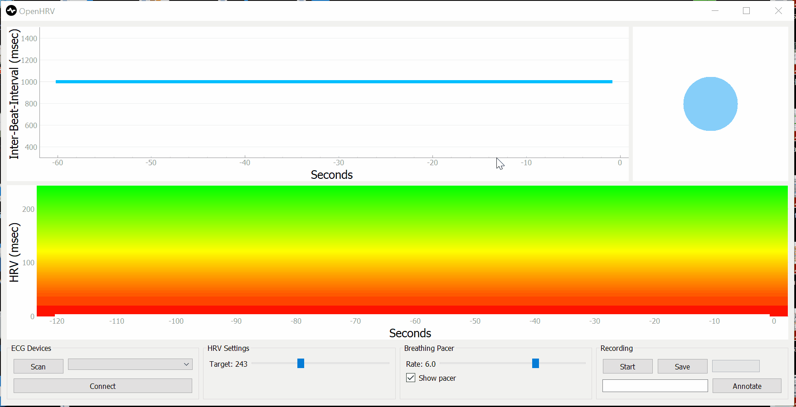
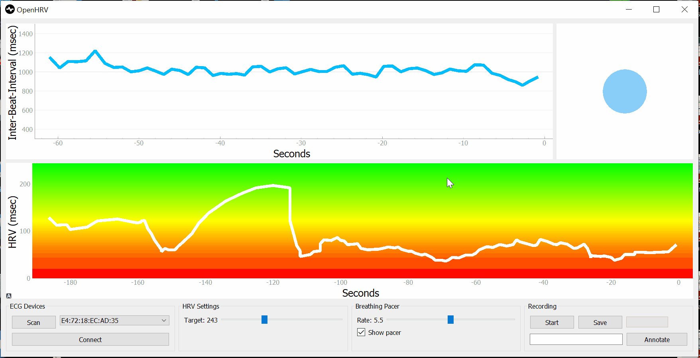

# OpenHRV

A desktop application for heart rate variability (HRV) biofeedback training with
Polar chest straps (H7, H9, H10).

## Installation

### Windows
Download [OpenHRV.exe](https://github.com/JanCBrammer/OpenHRV/releases/latest)
and run it, no installation required.

### Linux, MacOS, Windows

Clone the repository and run [OpenHRV.py](https://github.com/JanCBrammer/OpenHRV/blob/main/OpenHRV.py)
in a Python environment that contains the following dependencies:

* Python >= 3.8
* PySide2
* pyqtgraph
* numpy
* bleak

You can conveniently install these dependencies in a
[conda environment](https://docs.conda.io/projects/conda/en/latest/user-guide/tasks/manage-environments.html#creating-an-environment-from-an-environment-yml-file)
using the environment.yml [file](https://github.com/JanCBrammer/OpenHRV/blob/main/environment.yml).

## User Guide

### Connect your ECG sensor
Search your Polar sensor (H7, H9, or H10) by clicking `Scan`. The MAC addresses
of all detected Polar sensors show up in the drop-down menu. Select your sensor
and click `Connect`. The app will maintain a connection to the sensor until you
close the app or connect to another sensor. Connect to another sensor anytime by
repeating the process above.

### Set an HRV target
You can personalize the HRV target using the `Target` slider. After you've
been training for a while you will have a good idea of what's an attainable target
for you (this can vary depending on how much sleep or coffee you had etc.). You
can adjust the target anytime if you find the current target too easy or difficult.

### Set a breathing pace
The breathing pacer can help you increase your HRV. Breathe out as the blue
disk shrinks and breathe in as it gets larger. Explore how different breathing rates
affect your HRV by adjusting the `Rate` slider anytime during a session. Everyone
has a personal breathing rate at which their HRV is at its highest. Usually that
rate is somewhere between 4 and 7 breaths per minute. You can also hide the pacer
by unchecking the `Show pacer` box if you want to practice regulating HRV on your own.

### Biofeedback training
Below you can watch heart rate variability (HRV) biofeedback training in action. Note
how the blue heart rate curve rises and falls. These fluctuations are the "variability"
in HRV. Your goal is to get the fluctuations large and regular. As you get better at this,
the white HRV curve will go up. There is no "ideal" HRV, as in "everyone should achieve
an HRV of 500 msec". Try to increase HRV relative to what you have achieved before
and be aware that it can take a fair bit of practice to improve.

